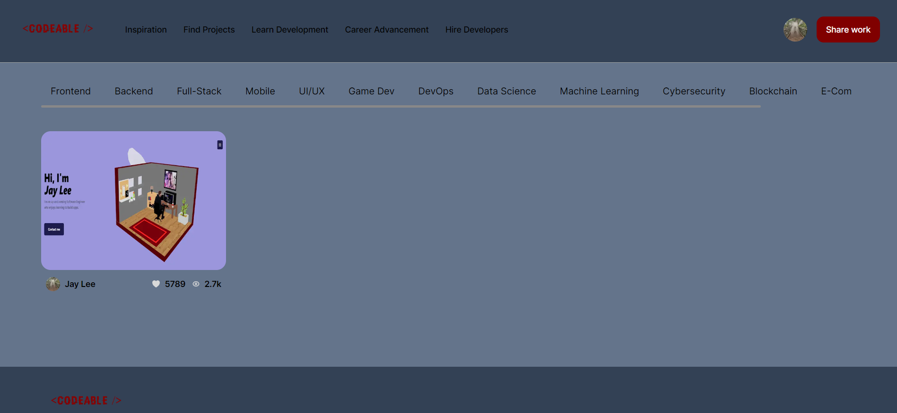

# Codeable

This project is a clone of the popular design community website Dribbble, built using Next.js and TypeScript. It aims to recreate the core functionality and design of Dribbble, allowing users to share their design work, discover inspiring designs, and interact with the design community.

## Features
* User Authentication: Users can create accounts, log in, and securely authenticate using encrypted passwords. This allows them to access personalized features such as uploading designs, commenting, and liking designs.
* Design Upload: Authenticated users can upload their design work, including images, project details, and tags. They can showcase their portfolio, get feedback from the community, and promote their work.
* Design Feed: The application provides a centralized feed where users can discover and explore various design works uploaded by the community. The feed can be filtered by popularity, recency, and specific tags.
* Design Details: Users can view detailed information about each design, including the designer's name, comments, likes, and related designs. They can engage with the design by leaving comments, liking it, and following the designer.
* User Profiles: Each user has a dedicated profile page that displays their uploaded designs, followers, following, and other relevant information. Users can follow other designers to stay updated with their latest work.
* Search: Users can search for specific designs, designers, or tags to find relevant content quickly. The search functionality provides real-time suggestions as users type.
* Responsive Design: The application is designed to be responsive, adapting to different screen sizes and devices, providing an optimal user experience on desktop, tablet, and mobile devices.

## Tech Stack
### The project utilizes the following technologies:

* Next.js: A React framework for server-side rendering, static site generation, and optimized performance.
* TypeScript: A statically typed superset of JavaScript that provides enhanced code quality, autocompletion, and error-checking during development.
* React: A JavaScript library for building user interfaces.
* Tailwind CSS: A utility-first CSS framework that enables rapid UI development and customization.
* Grafbase: A cloud-based backend service that provides authentication, real-time database, and storage for the application.

## Getting Started
### Follow these steps to get the project up and running on your local machine:

1. Clone the repository: Start by cloning this repository to your local machine using the following command:
git clone https://github.com/7Jay-Lee7/codeable.git

2. Install dependencies: Navigate to the project directory and install the required dependencies using your preferred package manager. For example, with npm:
cd codeable
npm install

3. Set up Grafbase: Create a Grafbase project and configure the authentication and database services. Update the Grafbase configuration in the project's code to connect it to your Grafbase project.

4. Start the development server: Launch the development server with the following command:
npm run dev
The application will be available at http://localhost:3000.

5. Build for production: If you want to build the project for production deployment, run the following command:
npm run build
This will generate an optimized production build in the out directory.

## Contributing
Contributions to this project are welcome. If you find any issues or have ideas for improvements, please open an issue or submit a pull request.

When contributing, please follow the existing code style, ensure that your changes are well-tested, and provide a clear description of the problem or feature you are addressing.

## License
This project is licensed under the MIT License. Feel free to use and modify the codebase for your own purposes.

## Acknowledgements
This project is inspired by the design and functionality of Dribbble. Special thanks to the Dribbble team and the open-source community for their contributions to the design and development ecosystem, aswell as JS Mastery for the tutorial.

## Contact
If you have any questions, suggestions, or feedback, please contact me at jaylee777@outlook.com.

Enjoy exploring and sharing your design work on the Dribbble Clone!